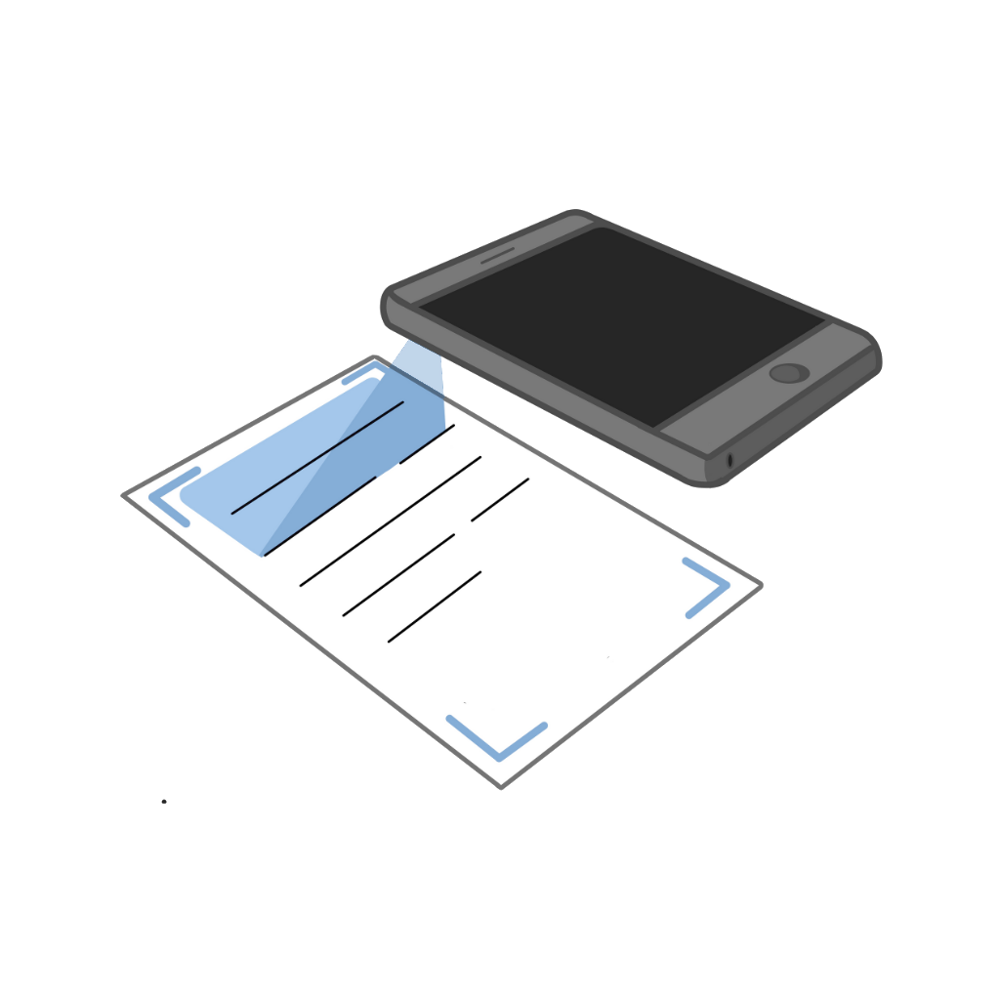

# DOCScan
DOCScan is a mobile application designed for quick and efficient document scanning. It eliminates the need for traditional scanning devices and manual text conversion, allowing users to scan documents using their mobile phones. This application is ideal for students, teachers, professionals, and anyone who needs to manage documents frequently.

## Table of Contents
1. [Motivation](#motivation)
2. [Project Structure](#project-structure)
3. [Development Resources](#development-resources)
4. [Application Architecture](#archite)
5. [Technical Implementation](#technical-implementation)
   - [Application Creation](#application-creation) 
   - [Application Walkthrough](#application-walkthrough)
6. [Login/Authentication System](#loginauthentication-system)
   - [System Architecture](#system-architecture)
   - [Firebase Integration](#firebase-integration)
7. [Document Scanning System](#document-scanning-system)
   - [Image to Digital Conversion](#image-to-digital-conversion)
   - [Applying Filters](#applying-filters)
8. [Text Extraction System](#text-extraction-system)
   - [Text Processing](#text-processing)
   - [Post-Processing and Display](#post-processing-and-display)
8. [Bibliography](#bibliography)
   
# Motivation
The idea behind DOCScan stemmed from the need for a mobile application that allows rapid document scanning and dynamic digital interaction with these documents. The application aims to enhance productivity by automating text extraction and facilitating efficient digital document management.

## Benefits of DOCScan:
1. Efficiency: Increases productivity by automating text extraction and organizing digital documents.
2. Accessibility: Allows quick access to information and fast searches within scanned documents.
3. Sustainability: Reduces dependency on physical documents, contributing to environmental conservation.

4. DOCScan is developed exclusively for iOS, requiring iOS version 17.0.0 or higher.

# Project Structure
DOCScan consists of the following fundamental components:

1. User Login/Authentication System
2. Document Scanning System
3. Text Detection and Extraction System

4. Each component was developed separately and then integrated into the application.

# Development Resources
The entire application was developed using Xcode, Apple's primary IDE for software development on Apple devices. Xcode provides a complete set of tools for writing code, designing the application interface, debugging, testing, and delivering the application to the App Store.

- GitHub Repository: DOCScan GitHub
- Media Resources: Created by Tania Tomici, including logos and icons.

# Application Architecture
The project is built using a class and object structure, with separate classes for each application screen. Each class receives and renders various information, ensuring ease of navigation and error resolution within the code.

# Technical Implementation
## Application Creation
DOCScan is developed using Swift and the SwiftUI framework. Swift is an object-oriented programming language known for its performance, simplicity, safety, and interoperability with Objective-C. SwiftUI is a visual framework that simplifies the creation of intuitive and interactive graphical interfaces.

## Application Walkthrough
1. Welcome Screen: Users can learn about the application and choose to log in or create an account.
2. Login/Sign Up: Users can log in with an existing account or sign up to create a new account.
3. Scanning Documents: Users can scan documents by positioning their phone over the document. The application automatically detects the document area and captures the image.
4. Editing Scans: Users can edit scans by cropping, applying filters, or rotating the image. After editing, the scan is saved, and the detected text is displayed.

# Login/Authentication System
## System Architecture
The authentication system saves user details (full name, email, and password) in the database for login purposes. Each user's scans and detected texts are also stored in the cloud.

## Firebase Integration
DOCScan uses Firebase for backend infrastructure, providing NoSQL databases, user authentication, cloud storage, and security features. Firebase Auth handles user authentication, while Firestore manages the database.

1. Setting Up Firebase:
   - Create a new project in the Firebase console.
   - Set up the login system and create the application database.
   - Generate the GoogleService-Info.plist file to link the application to Firebase Auth and Firestore.
2. Dependencies: Import necessary packages in Xcode and initialize Firebase in the DocsScanApp.swift file.

# Document Scanning System
## Image to Digital Conversion
The application converts scanned images to digital format, allowing users to work with the text extracted from the documents.

## Applying Filters
Users can apply various filters to the scanned documents to enhance the quality and readability of the text.

# Text Extraction System
## Text Processing
DOCScan uses Natural Language Processing (NLP) to process and extract text from the scanned documents.

## Post-Processing and Display
The extracted text is displayed in the application, allowing users to copy and use it as needed. The scans and texts are stored in the cloud for easy access from any device.

# Bibliography
Refer to the provided PDF for the bibliography section.